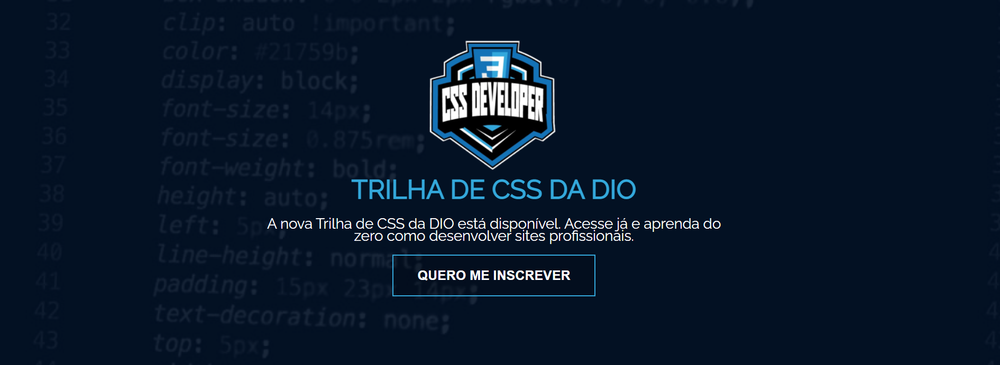
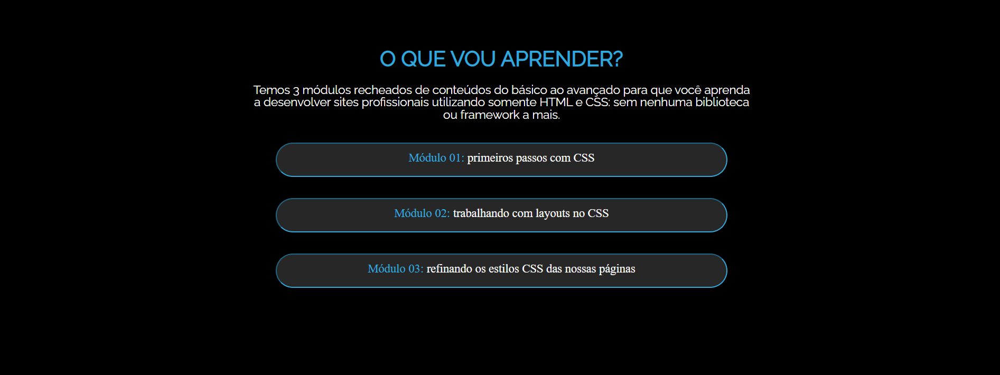
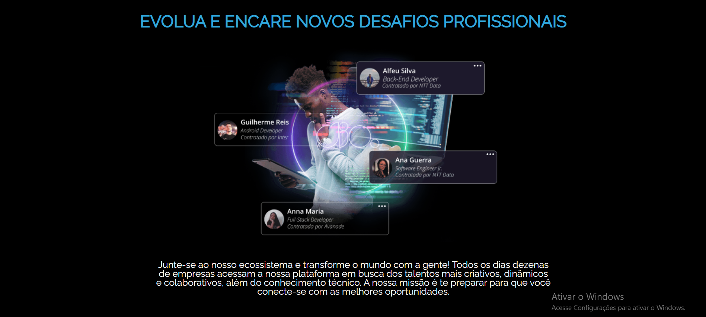
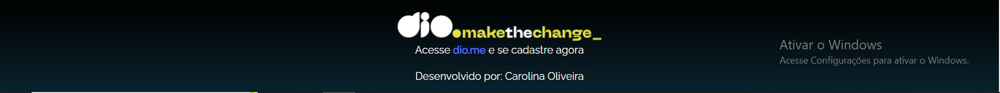

# SiteCompletoHTML-CSS_DIO

   - Bem vindo(a) ao primeiro desafio da Trilha de CSS da DIO! Nela, você vai construir sua primeira Landing Page com HTML e CSS, colocando em prática os fundamentos do CSS, as propriedades básicas da linguagem de estilização, além de trabalhar com as unidades de medidas relativas e absolutas que aprendemos ao longo da trilha.

* Criando sua Primeira Landing Page com HTML e CSS
  
  1. Foi utilizado um protótipo via Figma para orientação de como o design deveria ficar;
  2. Fiz algumas modificações no layout e design da página;

* Header:

* Módulos:

* Transforme o futuro:

* Evolua:

* Footer:

